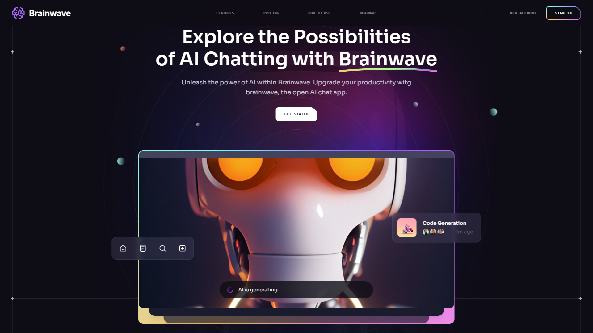

<h1 align=center>Brainwave AI Website</h1>


<a href="https://brainwave-tau-nine.vercel.app/">EXPERIMENTE</a>




> Website fictício para uma AI "Brainwave" desenvolvido usando React.js e Tailwind CSS, exemplifica princípios modernos de UI/UX. O site oferece um design elegante, animações incríveis e experiência geral para os usuários.
> 
## 📚 Aprendizados
Neste projeto, aprofundei meus conhecimentos em React e Tailwind CSS, efeitos parallax no mouse e na rolagem do site, conceitos modernos de UI/UX, posicionamento de elementos, bento grid e composição de cores.

## Tecnologias usadas
&nbsp;
<div align="center">
  &nbsp;
  &nbsp;
  
</div>

&nbsp;
---

### 💻 Pré-requisitos

- Versão mais recente do `Node.js`


### 🚀 Instalando e usando Brainwave

Clone:

```
git clone https://github.com/EmanuelGCosta/brainwave.git
```

Instalar pacote de dependências:
```
npm i
```

Inicializar servidor local:
```
npm run dev
```
Abra http://localhost:<numero_porta> em seu navegador
